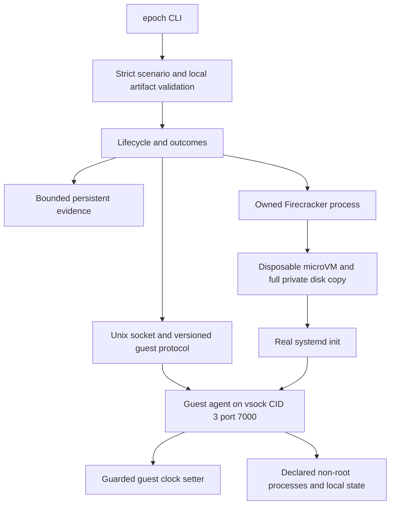

# Architecture and decisions

Epoch is general-purpose temporal systems-testing infrastructure. The host binary
is an ordinary-user foreground controller. The guest control agent is a separate
Linux binary supervised by real systemd init; “guest agent” here is transport and
process-control terminology, not an autonomous-agent domain model. Only guestclock
contains the real CLOCK_REALTIME setter, and an architecture test checks that the
Linux host dependency graph does not include that package.



The stable core boundary is:

```text
scenario declaration -> validation -> Firecracker lifecycle -> guest time control
  -> workload execution -> observations -> typed assertions -> evidence
  -> cleanup / recovery
```

Reference workloads sit above that boundary. `clock-probe` is the system-test
fixture. `agent-authority-expiry` is one incident-response expiry/TOCTOU example.
Its agent IDs, capabilities, resources, authority interval, authorization outcomes,
and simulated worker state do not appear in `cmd/` or `internal/`. Future batch,
subscription, or certificate workloads use the same generic action/observation
path rather than extending core with their business types.

## Review increments

1. Strict JSON/scenario validation and exact typed assertions. Duplicate keys,
   unknown/case-aliased fields, unsupported operations, bad pointers and invalid
   service/clock ordering fail before resource preparation.
2. Shared wire types, bounded vsock handshake/client, guarded guest clock and
   fixed-argv workload execution. The host sees observations, never an answer
   generated from the expected assertions.
3. Host privilege observations, exact executable identity, private copies, process
   supervision, operator admission lock and verified cleanup/recovery.
4. Lifecycle integration, independent verdict dimensions, evidence quotas, CLI,
   offline image recipe and opt-in system-test harness.

These are code review boundaries, not commits or release claims. Actual validation
is tracked separately in implementation-status.md.

## Chosen limits

There is one launch path (`--no-api --config-file`), one VM and one writer.
Small interfaces exist at process and guest transport boundaries so failure
ordering can be tested without KVM. The runtime does not contain a mock clock
alternative. Tests inject observations or a fake syscall boundary explicitly.

The runtime never attaches a NIC or mounts host directories. Loopback inside the
guest is available to application components. A full private byte copy was chosen
for straightforward ownership and failure behavior; it is not a VM snapshot.
No reflinks, restored memory or automatic action retry are implemented.
Consequently, current temporal branches are independent cold boots from equivalent
declared image inputs, not branches from identical memory/device state. See
`temporal-forking.md` for precise terminology and the snapshot-backed roadmap.

The agent's hello `ready` means control-channel readiness. A separate internal
barrier permits workload execution only after measured clock readback passes.
This distinction matters: a running agent alone does not establish simulated time.
Wall time then ticks normally; monotonic clocks and deadlines continue normally.

VMM configuration does not impose a host cgroup quota, and direct Firecracker
launch without the jailer is a documented trusted-lab limit. SELinux remains
enforcing; default seccomp remains enabled. Same-UID malicious peers and hostile
image/operator combinations are outside the initial profile.

Runtime dependencies are deliberately small: the standard library, x/sys Linux
primitives and mdlayher/vsock with its socket transport dependencies. Exact pins
are recorded in go.mod/go.sum and acquired only during preparation. Go 1.26.8
builds both production binaries without CGO; tests requiring race instrumentation
have separate C compiler requirements.
